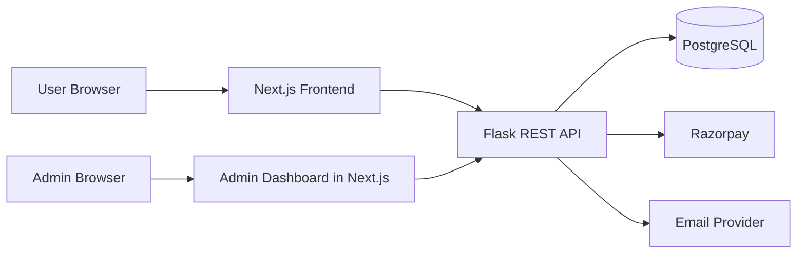
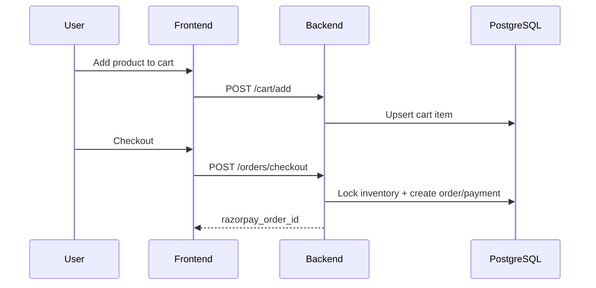
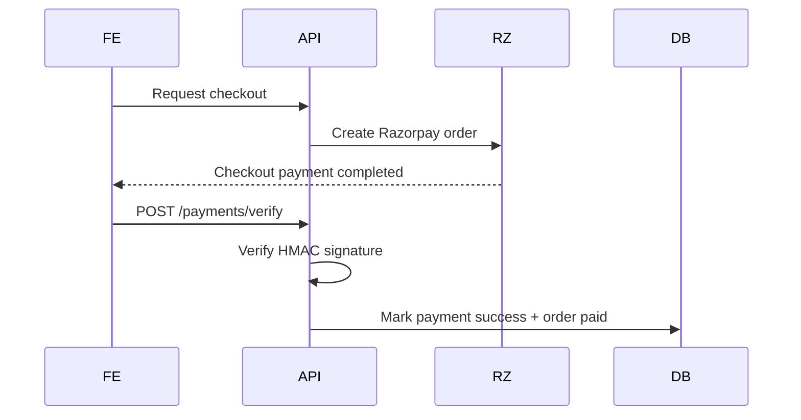
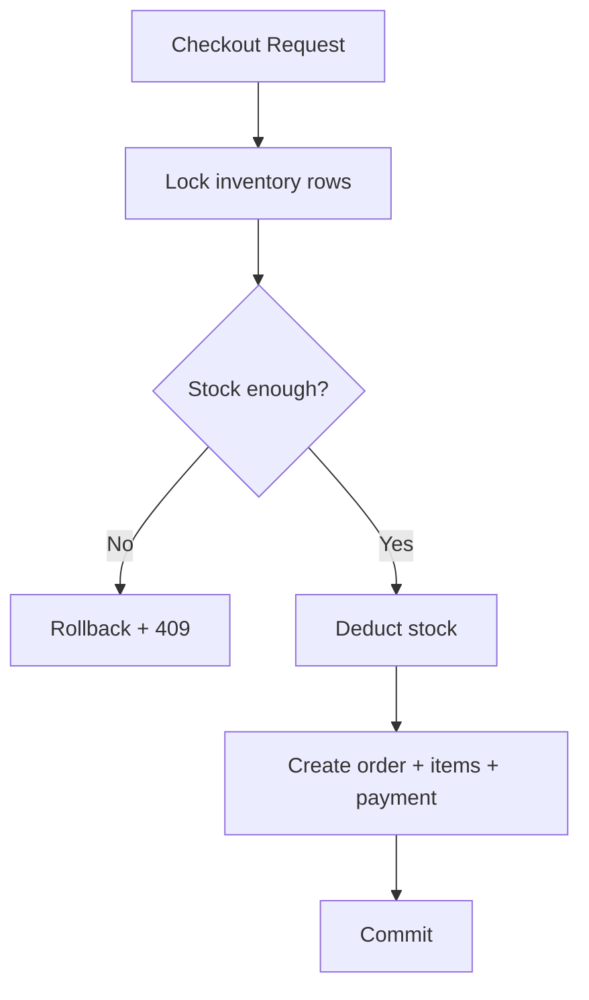

# Masala Commerce SaaS Platform (Production Blueprint)

Production-grade ecommerce SaaS architecture for selling masala products (Sambar Powder, Rasam Powder, Chicken Masala, Chilli Powder, Turmeric Powder, Idly Podi) with secure payments, admin operations, inventory control, and analytics.

## 1) Full System Architecture



### Request flow
1. Browser loads frontend from Next.js.
2. Frontend calls Flask APIs with JWT bearer token.
3. Flask validates token, validates payload, executes transactional DB operations.
4. For checkout, Flask creates Razorpay order and returns `razorpay_order_id`.
5. Frontend opens Razorpay Checkout and sends signature response to backend.
6. Backend verifies HMAC signature and finalizes payment/order state.

---

## 2) Production Folder Structure

```txt
backend/
  app/
    config/
    controllers/
    middlewares/
    models/
    routes/
    services/
    utils/
  tests/
  Dockerfile
  requirements.txt
  run.py

frontend/
  components/
  context/
  hooks/
  pages/
    admin/
    products/
  services/
  Dockerfile
  package.json

db/
  schema.sql
  analytics.sql

docker-compose.yml
README.md
```

---

## 3) PostgreSQL Schema
- Core entities: `users`, `admin_users`, `products`, `inventory`, `cart`, `orders`, `order_items`, `payments`.
- Includes PK/FK constraints, unique constraints (`email`, `slug`, `provider_order_id`), and indexes on search/join fields.
- Full SQL is in `db/schema.sql`.

---

## 4) REST API Design

### Auth
- `POST /auth/signup`
  - Request: `{ "name":"Asha", "email":"asha@x.com", "password":"StrongPass1" }`
  - Response: `{ "id": 1, "email":"asha@x.com" }`
- `POST /auth/login`
  - Response includes JWT token + role claims.

### Products
- `GET /products?search=sambar`
- `GET /products/{id}`

### Cart
- `POST /cart/add` `{ "product_id": 1, "quantity": 2 }`
- `GET /cart`

### Orders
- `POST /orders/checkout` `{ "address": { ... } }`
- `GET /orders`

### Payments
- `POST /payments/verify` with Razorpay IDs/signature.

### Admin
- `POST /admin/product`
- `PUT /admin/product/{id}`
- `DELETE /admin/product/{id}`
- `GET /admin/orders`
- `GET /admin/analytics/revenue`

---

## 5) Backend Implementation (Flask)
Implemented:
- App factory initialization (`create_app`) with CORS, JWT, bcrypt, SQLAlchemy, migrate, limiter.
- Controllers for auth, products, cart/checkout, payment verification.
- `SELECT ... FOR UPDATE` locking for inventory-safe checkout.
- Central error handling + logging.
- `.env` driven config in `app/config/settings.py`.

---

## 6) Frontend Implementation (Next.js)
Pages included:
- Home
- Product listing
- Product detail
- Cart
- Checkout
- Login
- Signup
- Order success

Admin pages:
- Dashboard
- Add/Update product
- View orders
- Revenue analytics
- Inventory page

Includes axios API client + token interceptor, auth context, cart context.

---

## 7) Admin Dashboard & Permissions
- Admin endpoints guarded using JWT + `admin_required` middleware.
- Role-based access via JWT claim (`role=admin`).
- Product CRUD, order visibility, and analytics APIs are admin-only.

---

## 8) Security Implementation
- Password hashing: bcrypt.
- JWT auth with short-lived access token.
- Input validation: Marshmallow schemas.
- SQL injection defense: ORM parameterization + no raw SQL in user paths.
- XSS defense: React rendering + sanitize any rich text before adding WYSIWYG.
- Rate limiting: Flask-Limiter (`100/min` global + tighter auth limits).
- Secrets in env vars only.
- Payment fraud prevention: HMAC signature verification + constant-time compare.
- HTTPS: terminate TLS at ingress/load balancer (Nginx/ALB/Cloudflare).

---

## 9) Razorpay Integration Steps
1. Create Razorpay business account.
2. Generate key id/secret and store in env.
3. Backend creates payment order (`services/payment_service.py`).
4. Frontend receives `razorpay_order_id` and opens checkout widget.
5. Frontend posts signature payload to `/payments/verify`.
6. Backend verifies signature and marks payment success/failure.
7. Persist all payment fields in `payments` table.

---

## 10) Docker Deployment
- `backend/Dockerfile`: gunicorn production server.
- `frontend/Dockerfile`: Next build and runtime image.
- `docker-compose.yml`: postgres + backend + frontend.

Run locally:
```bash
docker compose up --build
```

Cloud deployment options:
- AWS: ECS Fargate + RDS + ALB + CloudWatch
- DigitalOcean: App Platform + Managed PG
- Vercel: frontend + separate backend deployment

---

## 11) Inventory Management
- Stock decremented during checkout transaction under row lock.
- Example: `stock=100`, buy `3` → `97`.
- Prevent oversell via transactional locking (`FOR UPDATE`) and rollback on insufficient stock.

---

## 12) Analytics System
Queries in `db/analytics.sql`:
- Daily sales
- Monthly revenue
- Top selling products
- Inventory alert (stock <= reorder level)

---

## 13) Scalability Plan
- **100 users**: single app instances + managed postgres.
- **10,000 users**: horizontal API scaling, Redis cache/session, CDN for static assets, queue workers for emails.
- **1M users**: microservices split (catalog/order/payment), read replicas, partitioned tables, event streaming (Kafka), observability stack, WAF + bot management.

---

## 14) Optional AI Features
- Demand prediction (time-series on SKU sales).
- Recommendation engine (co-purchase and personalized ranking).
- Dynamic price optimization.
- Sales forecasting for procurement and stock planning.

---

## 15) Workflow Diagrams

### User order workflow


### Payment workflow


### Inventory update workflow


### Admin product management workflow
```mermaid
flowchart LR
  Admin --> UI[Admin UI]
  UI --> API[/admin/product APIs]
  API --> DB[(products + inventory)]
```

## Deployment Notes
- Put backend behind HTTPS reverse proxy.
- Store secrets in AWS Secrets Manager / Doppler / Vault.
- Enable monitoring, structured logs, and alerting for payment failures + low stock.
